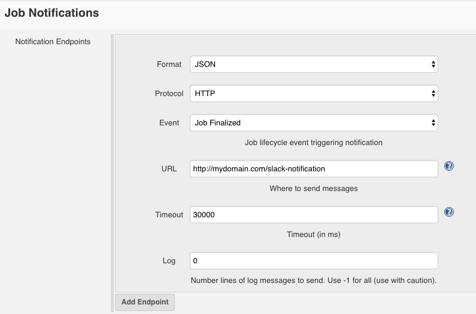

Jenkins Slack Notificator
=========

Allow notifications to Slack from Jenkins with a simple Webhook

## Installation

  `npm install jenkins-slack`

## Usage

    const App = require("./index");
    const config = {
      port: 8080
      token: "xoxb-XXXXXXXXX",
      channel: "XXXXXXXXX" //channel id, not name
    };

    const app = App(config);
  
Then, go to your job, configure, and in Job Notifications like:

The next parameters can be customized in config object:

    {
      route: "/slack-notification",
      port: 8080,
      processBody: body => ({
        name: body.name,
        url: body.build.full_url,
        status: body.build.status,
        scm: body.build.scm
      }),
      slackPostMessageUrl: "https://slack.com/api/chat.postMessage",
      textFormat: data =>
        `The job \`${data.name}\` has finished\nStatus: \`${data.status}\``
    }

## How to get token and channel

To get a token you can use your own or create an app https://api.slack.com/apps

To obtain channel id you can go to https://api.slack.com/methods/channels.list/test and get a list of channels.

## Contributing

In lieu of a formal style guide, take care to maintain the existing coding style. Add unit tests for any new or changed functionality. Lint and test your code.